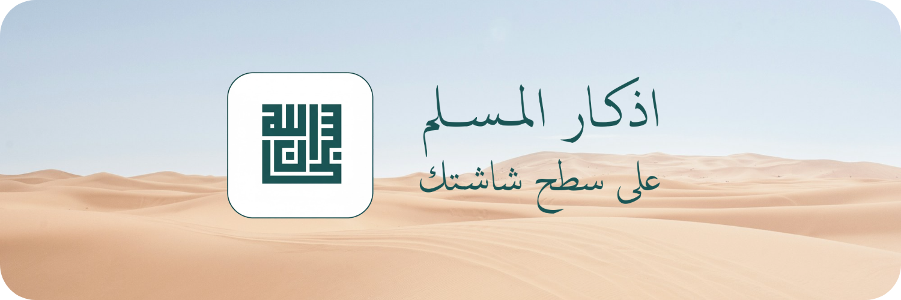
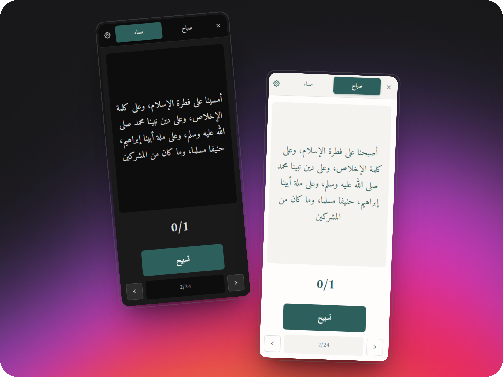

# 🌙 أذكار المسلم

**تطبيق سطح مكتب للمحافظة على أذكار الصباح والمساء**

برنامج بسيط وجميل يساعدك على المحافظة على الأذكار اليومية بطريقة سهلة ومريحة

---

## 📸 لقطات من البرنامج

---

## ✨ المميزات

- 📿 **أذكار صحيحة** - جميع الأذكار من مصادر موثوقة
- 🌓 **وضع ليلي ونهاري** - راحة للعين في جميع الأوقات
- 📊 **متابعة التقدم** - تتبع عدد مرات قراءة كل ذكر
- 🔊 **صوت اختياري** - تفعيل صوت عند النقر
- ⚙️ **إعدادات مرنة** - تخصيص حجم الخط والإعدادات
- 💻 **خفيف وسريع** - يعمل في الخلفية دون استهلاك موارد
- 🎯 **سهل الاستخدام** - واجهة بسيطة وواضحة

---

## 📥 التحميل والتثبيت

1. اضغط على زر التنزيل أعلاه
2. قم بتشغيل ملف التثبيت المحمل
3. اتبع خطوات التثبيت
4. افتح البرنامج من سطح المكتب

> حجم التحميل: حوالي 73 ميجابايت

---

## 📖 الأذكار المتضمنة

### أذكار الصباح (24 ذكر)

1. آية الكرسي (مرة واحدة)
2. "أصبحنا على فطرة الإسلام..." (مرة واحدة)
3. "رضيت بالله ربا..." (مرة واحدة)
4. "اللهم إني أسألك علما نافعا..." (مرة واحدة)
5. "اللهم بك أصبحنا..." (مرة واحدة)
6. "لا إله إلا الله وحده..." (10 مرات)
7. "يا حي يا قيوم..." (مرة واحدة)
8. سيد الاستغفار (مرة واحدة)
9. "اللهم فاطر السموات..." (مرة واحدة)
10. "أصبحنا وأصبح الملك لله..." (مرة واحدة)
11. "اللهم إني أسألك العافية..." (مرة واحدة)
12. "بسم الله الذي لا يضر..." (3 مرات)
13. "سبحان الله وبحمده عدد خلقه..." (3 مرات)
14. "اللهم عافني في بدني..." (3 مرات)
15. سورة الإخلاص (3 مرات)
16. سورة الفلق (3 مرات)
17. سورة الناس (3 مرات)
18. "حسبي الله لا إله إلا هو..." (7 مرات)
19. "اللهم إني أصبحت أشهدك..." (4 مرات)
20. "اللهم ما أصبح بي من نعمة..." (مرة واحدة)
21. "سبحان الله وبحمده" (100 مرة)
22. "أستغفر الله وأتوب إليه" (100 مرة)
23. "لا إله إلا الله وحده..." (100 مرة)
24. التسبيح الجامع (مرة واحدة)

### أذكار المساء (24 ذكر)

1. آية الكرسي (مرة واحدة)
2. "أمسينا على فطرة الإسلام..." (مرة واحدة)
3. "رضيت بالله ربا..." (مرة واحدة)
4. "اللهم بك أمسينا..." (مرة واحدة)
5. "لا إله إلا الله وحده..." (10 مرات)
6. "يا حي يا قيوم..." (مرة واحدة)
7. سيد الاستغفار (مرة واحدة)
8. "اللهم فاطر السموات..." (مرة واحدة)
9. "أمسينا وأمسى الملك لله..." (مرة واحدة)
10. "اللهم إني أسألك العافية..." (مرة واحدة)
11. "بسم الله الذي لا يضر..." (3 مرات)
12. "سبحان الله وبحمده عدد خلقه..." (3 مرات)
13. "اللهم عافني في بدني..." (3 مرات)
14. سورة الإخلاص (3 مرات)
15. سورة الفلق (3 مرات)
16. سورة الناس (3 مرات)
17. "حسبي الله لا إله إلا هو..." (7 مرات)
18. "اللهم إني أمسيت أشهدك..." (4 مرات)
19. "اللهم ما أمسى بي من نعمة..." (مرة واحدة)
20. "سبحان الله وبحمده" (100 مرة)
21. "أستغفر الله وأتوب إليه" (100 مرة)
22. "لا إله إلا الله وحده..." (100 مرة)
23. التسبيح الجامع (مرة واحدة)
24. "أعوذ بكلمات الله التامات..." (3 مرات)

---

## 🎮 طريقة الاستخدام

### الأزرار الرئيسية

- **صباح** - عرض أذكار الصباح
- **مساء** - عرض أذكار المساء
- **تسبيح** - عد الذكر الحالي
- **→ ←** - التنقل بين الأذكار
- **⚙️** - فتح الإعدادات
- **✕** - إخفاء النافذة إلى شريط المهام

### قائمة شريط المهام

انقر بزر الماوس الأيمن على أيقونة البرنامج:
- **إظهار** - إظهار النافذة
- **إخفاء** - إخفاء النافذة
- **الإعدادات** - فتح الإعدادات
- **خروج** - إغلاق البرنامج

### الإعدادات

- **حجم الخط** - تغيير حجم الخط (14-28)
- **تفعيل الصوت** - تفعيل صوت عند النقر
- **الوضع الداكن** - تفعيل الوضع الليلي
- **إعادة التعيين** - مسح جميع البيانات المحفوظة

---

## 💻 التقنيات المستخدمة

- **Electron** - إطار العمل لتطبيقات سطح المكتب
- **JavaScript** - لغة البرمجة
- **HTML/CSS** - واجهة المستخدم
- **خط أميري** - خط عربي جميل

---

## 📞 الدعم والتواصل

### للدعم والمساعدة

- 📧 **للتواصل المباشر:** [ahmed6093@gmail.com](mailto:ahmed6093@gmail.com)
- 🐛 **للإبلاغ عن مشكلة:** [افتح Issue](../../issues/new)
- 💡 **لاقتراح ميزة جديدة:** [اقترح ميزة](../../issues/new)

---

## 📜 الترخيص

هذا المشروع مرخص تحت رخصة MIT - يمكنك استخدامه وتعديله بحرية

---

**جعل الله هذا العمل في ميزان حسناتنا وحسناتكم** 🤲

**نسأل الله القبول والإخلاص**

⭐ **إذا أعجبك البرنامج، لا تنسى إضافة نجمة للمشروع** ⭐

